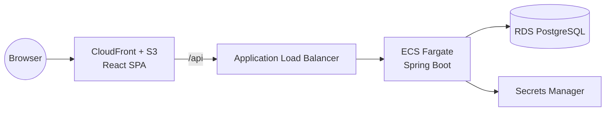

# Architecture

## System overview



## Backend module layout

The backend is a single Spring Boot deployable organized as package-by-domain
modules rather than a layered (controller/service/repo-wide) structure:

```
com.openhrm
├── auth            # login, organization registration, token issuance
├── organization     # tenant record
├── user             # login identity (email, password hash, role)
├── employee         # employee directory
├── leave            # leave requests and approval workflow
└── common
    ├── security     # JWT issuance/validation, Spring Security config
    ├── tenant       # request-scoped organization id
    └── exception    # RFC 7807 problem-detail error handling
```

Each module owns its entity, repository, service, and controller. Cross-module
calls go through a module's service, never its repository or entity directly.

## Multi-tenancy

Every table carries an `organization_id`. `JwtAuthFilter` decodes the
authenticated user's organization from their token and puts it in a
request-scoped `TenantContext`; every repository query and service method
filters by it explicitly (see [ADR 1](adr/0001-modular-monolith.md) for why
this is enforced at the application layer instead of Postgres row-level
security - simpler to reason about, at the cost of relying on every query
remembering to filter).

## Auth flow

See [ADR 2](adr/0002-self-issued-jwt-auth.md). In short: `POST
/api/v1/auth/register-organization` creates a tenant + its first ADMIN user in
one transaction; `POST /api/v1/auth/login` returns a signed JWT carrying
`organizationId`, `employeeId`, and `role` as claims.

## Infrastructure

See [ADR 3](adr/0003-terraform-for-infra.md) and `infra/`. The backend runs on
ECS Fargate behind an ALB; the frontend is a static build served from S3
through CloudFront. Both are defined as Terraform modules under
`infra/modules/`, composed for the `dev` environment under
`infra/environments/dev/`.
